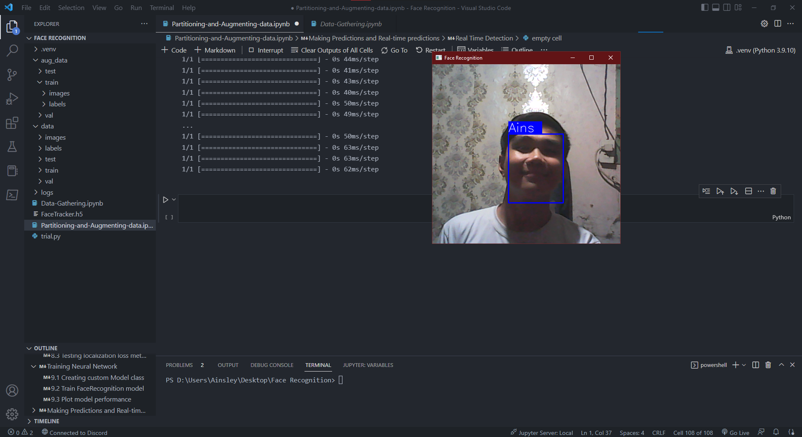

# Face Recognition
#### Face Recognition project using Tensorflow
First ever object detection project using Tensorflow, starting with Face Recognition Detection.



#### Table of Contents
****
**Data Gathering**
1. Setting up and getting data<br>
1.1 Install dependencies and setup<br>
1.2 Collecting images from webcam<br>
1.3 Annotate labels using LabelMe<br>

**Partitioning, Augmenting, Model Building, and Testing**
1. Review Dataset and Build Image Loading Function<br>
1.1 Limit GPU Memory Growth<br>
1.2 Load Image into TF Data Pipeline<br>
1.3 Visualize images using Matplotlib<br>
2. Partition unaugmented data<br>
2.1 Split images into Train, Test, and Val<br>
3. Apply Image Augmentation and Labels using Albumentations<br>
3.1 Setting up Albumentation Transform Pipeline<br>
3.2 Load a train image and annotation with OpenCV and JSON<br>
3.3 Extract coordinates and rescale to match image resolution<br>
3.4 Apply Augmentations and View Results<br>
4. Building Image Augmentation Pipeline<br>
4.1 Run Augmentation Pipeline<br>
4.2 Load Augmented Images to Tensorflow Dataset<br>
5. Preparing labels<br>
5.1 Load labels to Tensorflow Dataset<br>
6. Combine Image and Label Sample<br>
6.1 Creating Final Datasets (Images/Labels)<br>
6.2 View Images and Annotations<br>
7. Build Deep Learning using Functional API<br>
7.1 Build instance of Network<br>
7.2 Testing Neural Network<br>
8. Defining Losses and Optimization<br>
8.1 Define Optimizer and Learning Rate<br>
8.2 Define Localization Loss and Classification Loss<br>
8.3 Testing localization loss metric<br>
9. Training Neural Network<br>
9.1 Creating Custom Model Class<br>
9.2 Train FaceRecognition Model<br>
9.3 Plot model performance<br>
10. Making Predictions and Real-time predictions<br>
10.1 Predicting on Test Set<br>
10.2 Saving model<br>

**Real Time Detection using Webcam**
*****

#### Dependencies needed
```
!pip install labelme tensorflow tensorflow-gpu opencv-python matplotlib albumentations
```
